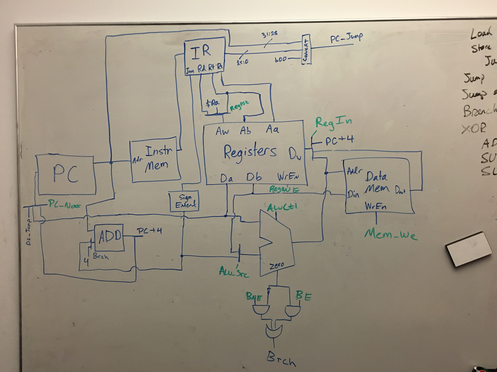

# Lab 3 Write-Up
#### Isaac Getto, David Abrahams, Kai Levy

## CPU Design



We chose to implement a single cycle CPU design. Our CPU is capable of implementing all required instructions -- `LW, SW, J, JR, JAL, BNE, XORI, ADD, SUB, SLT` -- as well as `BEQ`.

### Explanation of high-level design

Every instruction's RTL requires adding to the program counter, so on the left we have a `PC` block whose output goes into an adder, which adds either `4` or the Branch amount. This value is fed back into a mux that sets the `PC` to either the incremented value of `PC`, a jump value, or the data stored in a register.

We fetch the current instruction from Instruction Memory and then decode it using the `IR` block. These registers are fed into the Registers module, which fetches the value at two registers and writes to a third, if `WrEn=1`. We write either `PC+4` for a `JAL`, the value stored at in memory at register `rs` for a `LW`, or value coming off of our `ALU` for any of the math instructions.

The ALU takes in the values stored at register `rt` and the value at `rs`, or the sign extended immediate if we are doing a `LW` or `SW`. The ALU output is fed to the Data Memory address (because addresses are computed) and the data write of the register.

These components allow us to implement all of the following RTL:

### Instruction RTL

The following is how our CPU implements each instruction. Because our CPU is single-cycle, all instructions are implemented simultaneously (assuming there is no delay between each block):

#### `LW`

* Instr_Register = Instr_Memory[PC]
* PC = PC + 4
* A = Registers[rs]
* Result = A + Sign_Extend(Imm)
* Data_Reg = Data_Memory[Result]
* Registers[rt] = Data_Reg

#### `SW`

* Instr_Register = Instr_Memory[PC]
* PC = PC + 4
* A = Registers[rs]
* B = Registers[rt]
* Result = A + Sign_Extend(Imm)
* Mem[Result] = B

#### `J`

* Instr_Register = Instr_Memory[PC]
* PC = {PC[31:28], Instr_Register[25:0], b00}

#### `JR`

* Instr_Register = Instr_Memory[PC]
* A = Registers[rs]
* PC = A

**** `JAL`

* Instr_Register = Instr_Memory[PC]
* Registers[$ra] = PC + 4
* PC = {PC[31:28], Instr_Register[25:0], b00}

#### `BNE`

* Instr_Register = Instr_Memory[PC]
* A = Registers[rs]
* B = Registers[rt]
* Result = PC + Sign_Extend(Imm)
* if (A!=B) -> PC = Result

#### `BEQ`

* Instr_Register = Instr_Memory[PC]
* PC = PC + 4
* A = Registers[rs]
* B = Registers[rt]
* Result = PC + Sign_Extend(Imm)
* if (A==B) -> PC = Result

#### `ADD`

* Instr_Register = Instr_Memory[PC]
* PC = PC + 4
* A = Registers[rs]
* B = Registers[rt]
* Result = A + B
* RegFile[rd] = Result

#### `SUB`

* Instr_Register = Instr_Memory[PC]
* PC = PC + 4
* A = Registers[rs]
* B = Registers[rt]
* Result = A - B
* RegFile[rd] = Result

#### `SLT`

* Instr_Register = Instr_Memory[PC]
* PC = PC + 4
* A = Registers[rs]
* B = Registers[rt]
* Result = A < B
* RegFile[rd] = Result

## Testing

### Verilog Testing and Execution
To run a test for a specific module, run

```
CompArch-Lab3$ ./build/moduleToTest
```


To run all module tests, run:

```
./build/alltests
```

Each module test tests all of that module's functionality, and gives an output like this:

```
VCD info: dumpfile build/pc.vcd opened for output.
Testing PC
PC Tests Passed
```

if all functionality works as expected.

#### The ALU

```
CompArch-Lab3$ ./build/alu
```

The ALU tests do three tests of addition and subtraction, testing different combinations of carryout, overflow, and negative and positive operands. Similarly we test SLT with three sets of input to ensure our SLT works for every combination of negative and positive numbers. Finally, we test all simple logic (NOR, NAND, etc).

#### The Clock

```
CompArch-Lab3$ ./build/clock
```

The clock tests simply tests that the clock is switching on and off at the expected frequency at many different time points.

#### The Control Table

```
CompArch-Lab3$ ./build/controlTable
```

The control table sets all control signals in our top level cpu module. The tests give the control table every single `op` and `funct` code, and tests that the control signals are set appropriately.

#### The Data Memory

```
CompArch-Lab3$ ./build/datamemory
```

The datamemory can both read data from a given address, or write data to a given address. Our tests test both read and write capabilities at different addresses, and ensure that our memory is persistant between calls.

#### The Instruction Decoder

```
CompArch-Lab3$ ./build/instructionDecoder
```

The Instruction Decoder takes in takes in a 32-bit instruction and outputs the correct registers, immediate, and `funct` code. The tests give the decoder a series of instructions and checks that the outputs are what we expect.

#### The Multiplexer

```
CompArch-Lab3$ ./build/multiplexer
```

We have 2, 4, and 8 input multiplexers. The tests give the multiplexers a series of inputs and then address into different values, and check the output.

#### The Program Counter

```
CompArch-Lab3$ ./build/pc
```

The PC simply sets the PC to its input on positive clock edges. The tests check that the PC is being set properly and at the right time.

#### The Registers

```
CompArch-Lab3$ ./build/registers
```

The register holds 32 data values in registers, and sets certain registers (like the zeor register) to predefined values. On positive clock edges the register sets the output data values to the data contained in the registers, and writes to the write-register if write is enabled.

The tests test both the input and output functionality of the registers. We write to registers and then read from them.

### Assembly Tests

In order to test an assembly program, compile it with `MARS`, and dump the raw instructions to a text file. Modify `instructionRegister.v` to load the given textfile and run `$ ./build/cpu` to run the program.

### Testing Strategy
We tested each module in the CPU exhaustively with verilog tests.

Each of the tests for the control table and instruction decoder were simple: give them every possible input and check for every possible output.

For each of the "memory" components (registers, program counter, data memory), we tested by feeding in information and getting it back out.

The multiplexers were tested by feeding in information and checking that each selection worked.

The ALU was tested in the same methodology as in Lab 1, detailed [here](https://github.com/sarahwalters/CompArch-Lab1).

We then tested each CPU for each command separately with assembly code. The test programs are the in `assembly` folder, and were loaded by dumping the commands in binary to the `load` folder, before being loaded into the instruction memory. We checked that our execution yielded the desired results by examining the waveforms.

Finally, we ran the complete assembly tests (our `division.asm` and others) and checked our results with the instructions given in the `README`s.
